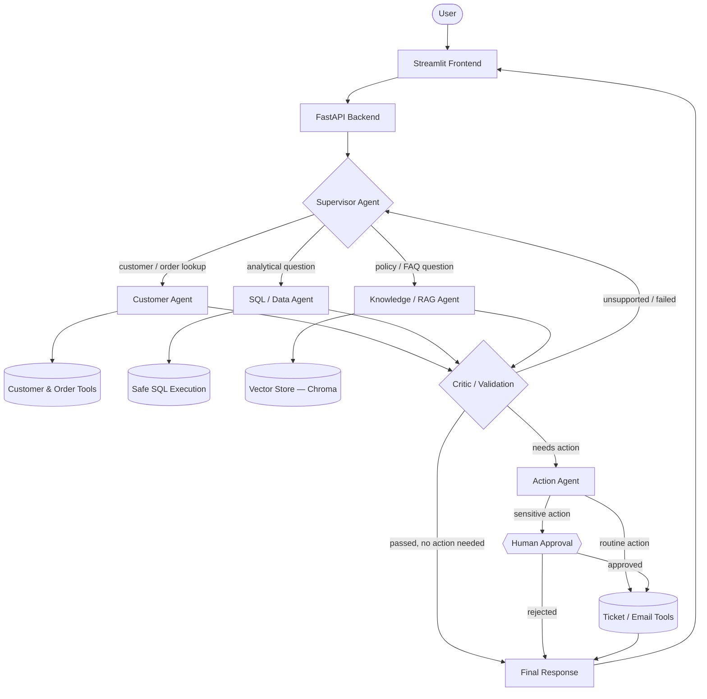
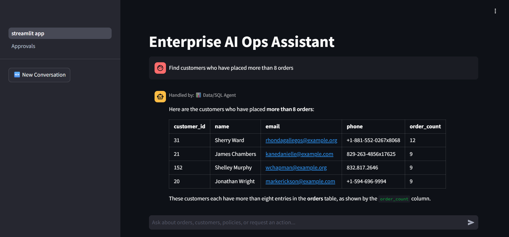
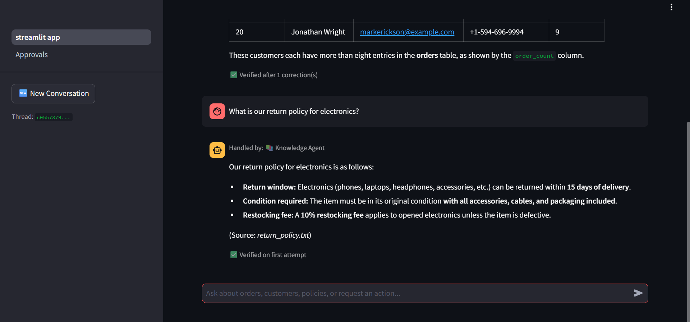
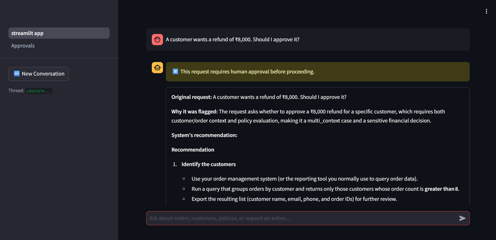
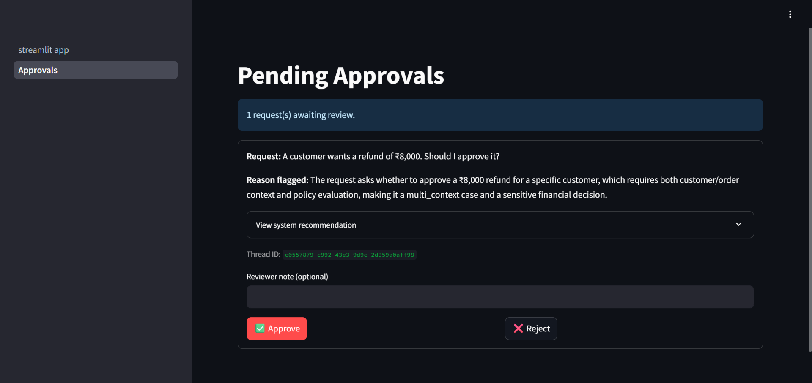

# Enterprise Multi-Agent AI Operations Assistant


A multi-agent operations assistant for a simulated e-commerce/enterprise support environment. A user asks a business question in plain language ("Where is order #1234?", "Find customers who have placed more than 5 orders", "A customer wants a refund of ₹8,000 — should I approve it?"); a supervisor agent decides which specialized agent(s) and tools are needed, retrieves data from a SQL database and a document knowledge base, takes action when required (tickets, emails), validates its own output before answering, and pauses for human approval on sensitive actions.

This is not a single LLM prompt wearing different hats — it's a graph of independent agents with their own tools, a shared state object, conditional routing between them, and a validation step that can send work back for another pass.

## Architecture



**How to read this:** the Supervisor doesn't answer questions itself — it routes to whichever agent(s) the request actually needs, sometimes more than one. Every agent's output passes through the Critic before it's allowed back to the user; if the Critic finds the answer isn't backed by what the tools actually returned, the request goes back for another pass instead of returning an unsupported claim. Sensitive actions (refunds, emails, ticket creation above a threshold) pause the graph entirely and wait for a human decision before continuing.

## Agents

| Agent | Responsibility |
|---|---|
| **Supervisor** | Interprets the request, plans which agent(s)/tools are needed, routes tasks, maintains shared state across the conversation |
| **Customer Agent** | Looks up customers, orders, and order history |
| **SQL / Data Agent** | Turns analytical questions into SQL, executes it through a read-only safe-query tool, never runs unrestricted/destructive SQL |
| **Knowledge / RAG Agent** | Answers policy/FAQ questions by retrieving from indexed company documents, cites sources, says so explicitly when nothing relevant is found |
| **Action Agent** | Creates support tickets, prepares/sends emails, updates records — routes sensitive actions to human approval instead of executing them directly |
| **Critic / Validation** | Checks agent output against what the tools actually returned; sends the request back for another pass if a claim isn't supported |

## Tech stack

Python · LangChain · LangGraph · FastAPI · Pydantic · Streamlit · PostgreSQL · Chroma (vector DB) · sentence-transformers (embeddings) · MCP (Model Context Protocol) · Docker & Docker Compose · AWS EC2 · LangSmith · Groq (LLM API) · pytest

## Setup

### Option A — Docker Compose (recommended, matches production)

Requires Docker Desktop (or Docker Engine + Compose plugin on Linux).

```bash
git clone https://github.com/mSwara/enterprise-ai-ops-assistant.git
cd enterprise-ai-ops-assistant
cp .env.example .env
```

Edit `.env` and fill in real values for `LLM_API_KEY` (a [Groq](https://console.groq.com) API key), `LLM_MODEL`, and `POSTGRES_PASSWORD` (any password — just keep it consistent with the password portion of `DATABASE_URL` on the line above it). `LANGSMITH_*` is optional; leave `LANGSMITH_TRACING=false` to skip tracing.

```bash
docker compose up --build -d
```

First build takes a few minutes (embedding model download included). Once it's up, seed the database with synthetic data:

```bash
docker compose exec backend python -m app.db.seed_data
```

Then open **http://localhost:8501** — the Streamlit chat UI.

Check everything's healthy:
```bash
docker compose ps
```
All 3 services (`postgres`, `backend`, `frontend`) should show `Up` (`postgres` as `Up (healthy)`).

### Option B — Run locally without Docker

Requires Python 3.11+ and a running PostgreSQL instance.

```bash
git clone https://github.com/mSwara/enterprise-ai-ops-assistant.git
cd enterprise-ai-ops-assistant
cp .env.example .env   # fill in your values, DATABASE_URL pointing at your local Postgres
```

**Backend:**
```bash
cd backend
python -m venv venv
venv\Scripts\activate        # Windows — use `source venv/bin/activate` on macOS/Linux
pip install -r requirements.txt
python -m app.db.seed_data   # creates tables and seeds synthetic data
uvicorn app.main:app --reload --port 8000
```

**MCP server** (separate terminal, backend venv active):
```bash
python -m app.mcp.mcp_server
```

**Frontend** (separate terminal):
```bash
cd frontend
python -m venv venv
venv\Scripts\activate
pip install -r requirements.txt
streamlit run streamlit_app.py
```

Open **http://localhost:8501**.

## API documentation

The backend auto-generates interactive Swagger docs — once running, visit:
```
http://localhost:8000/docs
```

Core endpoints:

| Method | Path | Purpose |
|---|---|---|
| `POST` | `/chat` | Send a user message into the agent graph, get the routed response |
| `GET` | `/approvals` | List actions currently paused awaiting human approval |
| `POST` | `/approvals/{thread_id}/resume` | Approve or reject a paused action, resuming the graph |
| `GET` | `/customers`, `/orders`, `/payments`, `/tickets` | Direct read access to seeded synthetic data |
| `GET` | `/health` | Health check |

## Screenshots

**Routing to a specialized agent** — the Data/SQL Agent turns a plain-language analytical question into a query and returns structured results, not a generic chat reply:



**Source-grounded RAG** — the Knowledge Agent answers from an indexed policy document and cites exactly which one, rather than generating an answer from general knowledge:



**Human-in-the-loop for sensitive actions** — a refund approval request pauses the graph instead of executing automatically, showing why it was flagged and a system recommendation:



A reviewer resolves it on a dedicated Approvals screen, with full context and an explicit Approve/Reject decision:



## Limitations & future improvements

- **Single-node deployment** — everything runs on one EC2 instance with no load balancing or auto-scaling; fine for a portfolio demo, not for real production traffic.
- **No authentication** — the API and frontend are open to anyone with the URL; a real deployment would need user accounts and access control, especially given the sensitive actions (refunds, customer data) it can perform.
- **Synthetic data only** — customers, orders, and policies are generated/sample data, not connected to a real CRM or order system.
- **Manual RAG re-ingestion** — updating the policy documents requires re-running `python -m app.rag.ingest` by hand; no automatic re-indexing on document change.
- **Single-instance memory** — conversation state persists via LangGraph's checkpointer but hasn't been tested under concurrent multi-user load.

Future improvements worth exploring: swap the single EC2 instance for a managed container service (ECS/Fargate) with auto-scaling, add authentication and per-role permissions, connect to a real e-commerce backend instead of synthetic data, add a scheduled re-ingestion job for the knowledge base, and expand the evaluation suite (routing accuracy, RAG faithfulness, HITL correctness) with a larger labeled test set.

